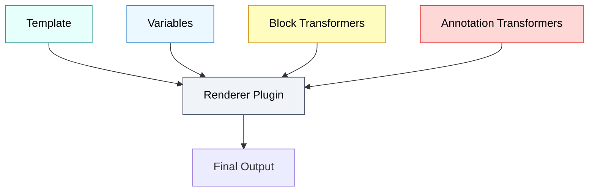
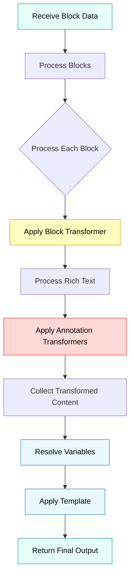
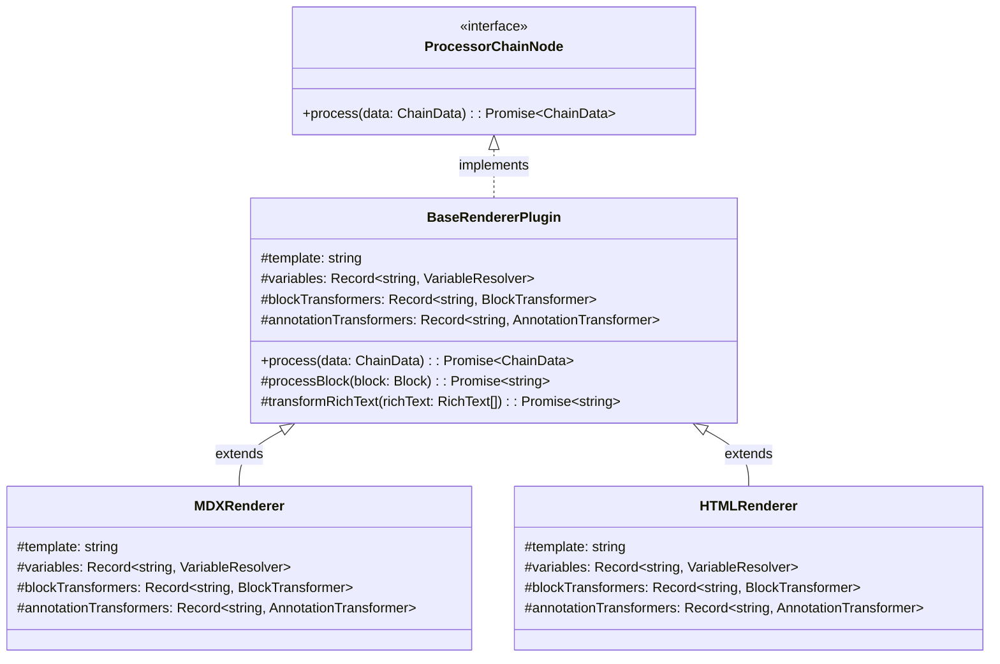

Renderer plugins form the heart of notion-to-md v4's transformation system. They determine how Notion blocks are converted into your desired output format, whether that's Markdown, HTML, JSX, or any other text-based format.

This guide is a must read for anyone looking to customize existing plugins or create new ones from scratch.

## Core Components







Every renderer plugin consists of four essential components:



## Renderer Lifecycle and Flow

The rendering process follows a specific flow:



1. **Initialization**: The renderer receives block data from the processor chain
2. **Block Processing**: Each block is processed according to its type
   - The appropriate block transformer is applied
   - Rich text within the block is processed
   - Annotation transformers are applied to format text
3. **Content Collection**: Transformed blocks are collected
4. **Variable Resolution**: Template variables are resolved
5. **Template Application**: The template is populated with variable content
6. **Output**: The final formatted content is returned

## Core Architecture

Renderer plugins are built on the `BaseRendererPlugin` abstract class, which implements the `ProcessorChainNode` interface:



This architecture provides a consistent interface while allowing for complete customization of the rendering process.

## Data Context

Throughout the rendering process, components have access to a comprehensive [context object](context):

```typescript
interface RendererContext {
  pageId: string; // The Notion page ID
  pageProperties: PageProperties; // Notion page properties
  metadata: ContextMetadata; // Additional metadata
  block: Block; // Current block (during transforms)
  blockTree: Block[]; // All blocks
  variableData: VariableCollector; // Collected variable data
  transformers: {
    blocks: Record<BlockType, BlockTransformer>;
    annotations: Record<AnnotationType, AnnotationTransformer>;
  };
  utils: {
    transformRichText: (richText: RichText[]) => Promise<string>;
    processBlock: (block: Block) => Promise<string>;
  };
}
```

This context provides access to everything needed for sophisticated rendering decisions, from page metadata to utility functions.

## Default Renderer

notion-to-md v4 comes with a default MD/MDX renderer, which serves as both a useful default and an example implementation:


For detailed view at the implementation, please refer the [default renderer notion-to-md ships](https://github.com/souvikinator/notion-to-md/tree/v4.0.0-alpha/src/plugins/renderer/mdx) with, as it's a good reference for creating your own renderer.


```javascript
// Default MDX renderer (simplified)
class MDXRenderer extends BaseRendererPlugin {
  protected template = `{{{frontmatter}}}{{{imports}}}{{{content}}}`;

  // Default variables for frontmatter, imports, and content
  protected variables = { /* ... */ };

  // Transformers for Markdown formatting
  protected blockTransformers = { /* ... */ };
  protected annotationTransformers = { /* ... */ };
}
```

Using a renderer is straightforward:

```javascript
// Using the default renderer
const n2m = new NotionConverter(notionClient);

// Using a custom renderer
const htmlRenderer = new HTMLRenderer();
const n2m = new NotionConverter(notionClient).withRenderer(htmlRenderer);
```
