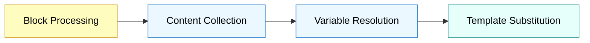

### 1. Template

The template defines the overall structure of your output document. It uses a simple variable substitution system with triple curly braces (`{{{variableName}}}`).

It acts as a scaffold, determining where different parts of the content will appear in the final output. When creating a custom renderer, you can assign blocks to specific variables;
by default, they are placed in the content variable. The content variable is mandatory and must be included in the template. We'll explore this as we move ahead.

#### Template Examples for Different Output Formats

{}

```md
{{{frontmatter}}}

{{{imports}}}

{{{content}}}
```

{}

{}

```html
<!DOCTYPE html>
<html lang="en">
<head>
  <meta charset="UTF-8">
  <meta name="viewport" content="width=device-width, initial-scale=1.0">
  <title>{{{title}}}</title>
  {{{metatags}}}
  {{{stylesheets}}}
</head>
<body>
  <article class="notion-content">
    {{{content}}}
  </article>
  {{{scripts}}}
</body>
</html>
```

{}

{}

```jsx
{{{imports}}}

// can use a variable for naming components as well
export function NotionPage({
  className,
  components = {},
  ...props
}) {
  return (
    <article className={`notion-content ${className || ''}`} {...props}>
      {{{frontmatter}}}
      {{{content}}}
    </article>
  );
}

{{{metadataExport}}}
```

{}

{}

```latex
\documentclass{article}

{{{packages}}}

\title{{{{title}}}}
\author{{{{author}}}}
\date{{{{date}}}}

\begin{document}

\maketitle

{{{content}}}

\end{document}
```

{}


### 2. Variables and The Variable System

Variables are dynamic content providers that populate the template.

#### How Variables Work

At its core, the variable system works by:
1. Collecting content during the rendering process
2. Organizing it into named collections
3. Resolving those collections into strings
4. Substituting the resolved strings into the template





#### Default vs. Custom Variables

The base renderer includes essential variables:
- `content` - The main content of the document
- `imports` - The import statements for the document (may or may not be used)

You can extend these with custom variables for specialized needs.


  Note that when creating a new renderer plugin it's must to include the `content` and `imports` variables in your template.


#### Variable Resolvers

Variables collect content throughout the rendering process, but before being used in the template, this content needs to be formatted. This is where variable resolvers come in.

##### What is a Variable Resolver?
- It's a function that takes collected content and formats it for final output
- It receives the full rendering context and returns a formatted string

Variables can work in two ways:
1. As collectors that gather content during rendering and then the resolver formats it for final output in the template.
**Collection-based Variables**
These variables collect content throughout the rendering process:
```typescript
// Variable that collects content
renderer.addVariable('sidebar');

// Content returned from the transformer gets collected in this variable
// and all the collected content is passed to the resolver to format it for
// final output in the template.
someBlockTransformer.targetVariable = 'sidebar';
```

2. As generators that produce content through their resolvers (usecase: frontmatter, footnotes, etc)
**Generator Variables**
These variables don't collect anything but generate content through their resolver:
```typescript
// Variable that generates content through its resolver
renderer.addVariable('frontmatter', async (name, context) => {
  const title = context.pageProperties?.title || 'Untitled';
  const date = new Date().toISOString();

  return `---
title: ${title}
date: ${date}
---`;
});
```



To get a clear idea about the transformers and variables interactions, check out the [block transformer](/docs/v4/concepts/renderer-plugin/block-transformer) page.


##### Default Resolution
If you don't provide a custom resolver, variables use a simple default resolver that:
- Takes all collected content
- Joins it with newlines (`\n`)
- Returns the combined string

Each resolver has access to the complete [rendering context](https://github.com/souvikinator/notion-to-md/blob/67c63a66bad6b51c0d2852062d7be732ed984176/src/types/renderer.ts#L28-L54), including page properties, collected content, and processing state. The results of these resolvers are inserted into the template wherever the corresponding `{{{variableName}}}` appears.

{}

Let's see how variables are resolved in practice:

**1. During block processing, content is collected:**

```javascript
// After processing some blocks, variableData might contain:
variableData = {
  content: [
    "# Introduction",
    "This is a paragraph with **bold text**.",
    "- Item one\n- Item two",
  ],
  imports: [
    "import { Editor } from './components/code';",
    "import { Accordion } from './components/accordion';"
  ]
}
```

**2. When rendering completes, variable resolvers are called:**

```javascript
// The frontmatter resolver returns:
"---\ntitle: My Page\ndate: 2025-03-05T12:34:56.789Z\n---"

// The imports resolver returns:
"import { Editor } from './components/code';\nimport { Accordion } from './components/accordion';"

// The content resolver returns:
"# Introduction\nThis is a paragraph with **bold text**.\n- Item one\n- Item two"
```

**3. The resolved values replace variables in the template:**

```markdown
<!--
Template:

{{{frontmatter}}}

{{{imports}}}

{{{content}}}

-->

<!-- Final output: -->
---
title: My Page
date: 2025-03-05T12:34:56.789Z
---

import { Editor } from './components/code';
import { Accordion } from './components/accordion';

# Introduction
This is a paragraph with **bold text**.
- Item one
- Item two
```

This simple but powerful system makes it easy to create well-structured documents with dynamic content.

{}

#### Variable Examples for Different Formats

{}
```typescript
protected variables = {
  title: (context) =>
    context.pageProperties?.title?.title?.[0]?.plain_text || 'Notion Page',

  metatags: (context) => {
    const description = context.pageProperties?.description?.rich_text?.[0]?.plain_text || '';
    const tags = context.pageProperties?.tags?.multi_select?.map(tag => tag.name).join(', ') || '';

    return `
      <meta name="description" content="${description}">
      <meta name="keywords" content="${tags}">
      <meta property="og:title" content="${context.pageProperties?.title?.title?.[0]?.plain_text || ''}">
      <meta property="og:description" content="${description}">
    `;
  },

  stylesheets: () => {
    const styles = context.variableData.get('stylesheets') || [];
    return styles.join('\n');
  },

  scripts: () => `
    <script src="/scripts/prism.js"></script>
    <script>
      document.addEventListener('DOMContentLoaded', function() {
        Prism.highlightAll();
      });
    </script>
  `,

  content: (context) => {
    const contentBlocks = context.variableData.get('content') || [];
    return contentBlocks.join('\n');
  }
};
```
{}

{}
```typescript
protected variables = {
  imports: (context) => {
    const defaultImports = [
      'import React from "react";',
      'import { MDXProvider } from "@mdx-js/react";'
    ];

    const collectedImports = context.variableData.get('imports') || [];
    return [...defaultImports, ...collectedImports].join('\n');
  },

  frontmatter: (context) => {
    const title = context.pageProperties?.title?.title?.[0]?.plain_text || 'Untitled';
    const description = context.pageProperties?.description?.rich_text?.[0]?.plain_text || '';

    return `
      <header className="page-header">
        <h1>{${JSON.stringify(title)}}</h1>
        <p className="description">{${JSON.stringify(description)}}</p>
      </header>
    `;
  },

  content: (context) => {
    const contentBlocks = context.variableData.get('content') || [];
    return contentBlocks.join('\n');
  },

  metadataExport: (context) => {
    const metadata = {
      title: context.pageProperties?.title?.title?.[0]?.plain_text || 'Untitled',
      description: context.pageProperties?.description?.rich_text?.[0]?.plain_text || '',
      tags: context.pageProperties?.tags?.multi_select?.map(tag => tag.name) || [],
      lastUpdated: context.pageProperties?.last_edited_time || new Date().toISOString()
    };

    return `
export const metadata = ${JSON.stringify(metadata, null, 2)};
`;
  }
};
```
{}

{}
```typescript
protected variables = {
  packages: () => `
\\usepackage{amsmath}
\\usepackage{graphicx}
\\usepackage{hyperref}
\\usepackage{listings}
\\usepackage{xcolor}
  `,

  title: (context) =>
    this.escapeLatex(context.pageProperties?.title?.title?.[0]?.plain_text || 'Untitled'),

  author: (context) => {
    const author = context.pageProperties?.author?.rich_text?.[0]?.plain_text;
    return author ? this.escapeLatex(author) : 'Anonymous';
  },

  date: () => '\\today',

  content: (context) => {
    const contentBlocks = context.variableData.get('content') || [];
    return contentBlocks.join('\n');
  }
};
```
{}

{}

Here's how you might implement a custom table of contents variable:

```typescript
protected variables = {
  // Other variables...

  tableOfContents: (context) => {
    // Find all heading blocks from the processed content
    const headings = context.variableData.get('content')
      .filter(line => line.startsWith('#'))
      .map(heading => {
        const level = heading.match(/^(#+)/)[0].length;
        const text = heading.replace(/^#+\s+/, '');
        const indent = '  '.repeat(level - 1);
        const slug = text.toLowerCase().replace(/[^\w]+/g, '-');
        return `${indent}- [${text}](#${slug})`;
      })
      .join('\n');

    return headings ? `## Table of Contents\n\n${headings}\n\n` : '';
  }
};
```

Then update your template to include it:

```markdown
{{{frontmatter}}}

{{{imports}}}

{{{tableOfContents}}}

{{{content}}}
```


To explore more about how to modify an existing renderer plugin based on your needs, refer to the [Modifying Plugin](/docs/v4/concepts/renderer-plugin/modifying-plugin) guide.


{}

## Best Practices for Variables

- **Keep variables focused** - Each variable should have a clear responsibility
- **Use the context object** - Leverage the available data for dynamic content
- **Use appropriate variables** - Put content in logical variables (don't overload `content`)
