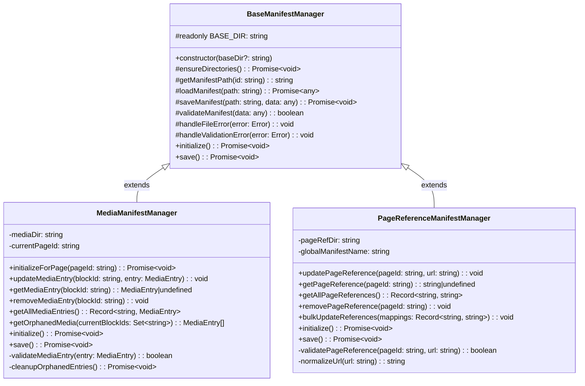
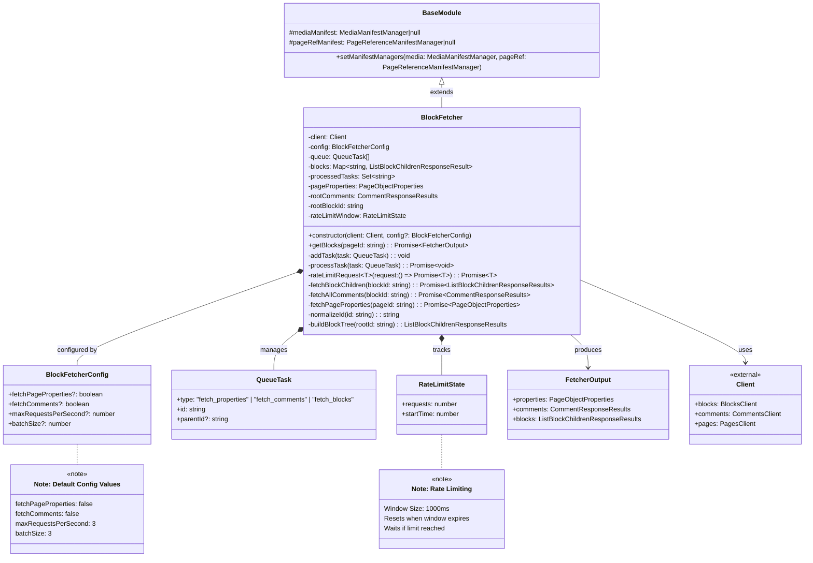
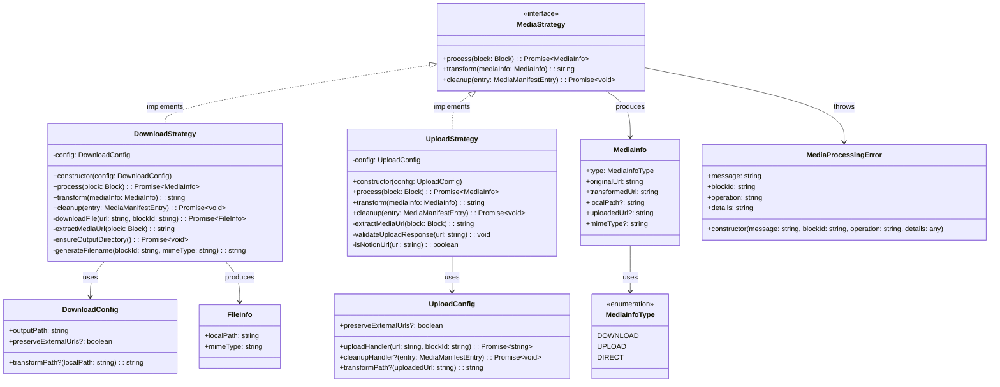
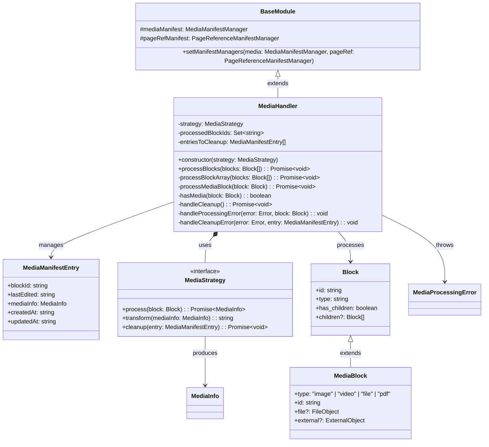
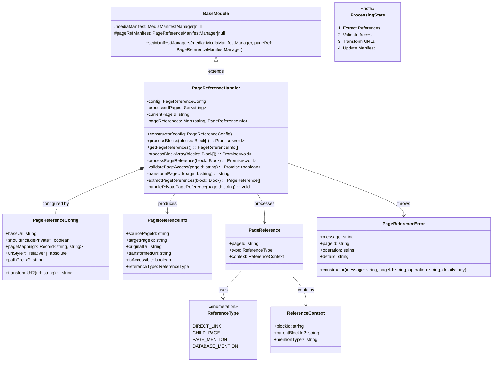
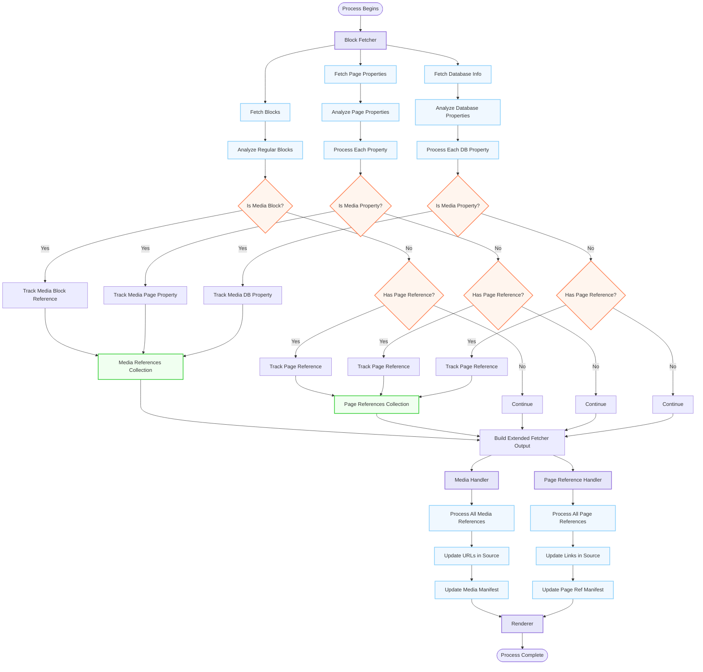
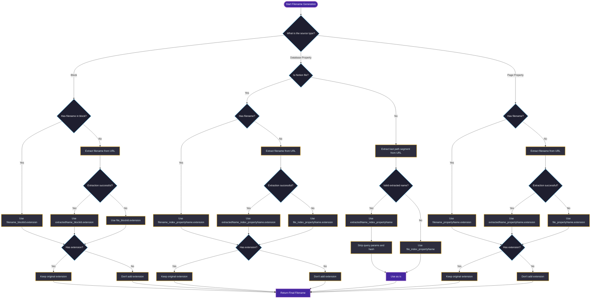

# Class architecture

## Birds eye view

```mermaid
classDiagram
    class NotionConverter {
        %% Core Dependencies
        -client: Client
        -manifestManager: ManifestManager
        -blockFetcher: BlockFetcher
        -mediaHandler: MediaHandler|null
        -pageReferenceHandler: PageReferenceHandler
        -renderer: RendererPlugin

        %% Configuration
        -config: NotionConverterConfig
        -outputPath: string
        -mediaConfig: MediaConfig|null

        %% Constructor
        +constructor(client: Client, config?: NotionConverterConfig)

        %% Builder Methods
        +setOutputPath(path: string): this
        +downloadMediaTo(config: DownloadConfig): this
        +uploadMediaUsing(config: UploadConfig): this
        +withPageReferences(config: PageRefConfig): this
        +withRenderer(renderer: RendererPlugin): this

        %% Core Operation
        +convert(pageId: string): Promise~ConversionResult~

        %% Private Methods
        -initializeModules(pageId: string): Promise~void~
        -validateConfiguration(): void
        -createMediaStrategy(): MediaStrategy
        -handleConversionError(error: Error): ConversionError
    }

    %% Core Modules
    class BlockFetcher {
        -client: Client
        -config: BlockFetcherConfig
        +getBlocks(pageId: string): Promise~FetcherOutput~
    }

    class MediaHandler {
        -strategy: MediaStrategy
        +processBlocks(blocks: Block[]): Promise~void~
    }

    class PageReferenceHandler {
        -config: PageRefConfig
        +processBlocks(blocks: Block[]): Promise~void~
    }

    class RendererPlugin {
        +render(blocks: Block[]): Promise~string~
    }

    %% Configuration Types
    class NotionConverterConfig {
        +outputPath?: string
        +defaultRenderer?: RendererPlugin
        +blockFetcherConfig?: BlockFetcherConfig
        +pageReferenceConfig?: PageRefConfig
        +validateConfig?: boolean
        +debug?: boolean
    }

    class BlockFetcherConfig {
        +fetchPageProperties?: boolean
        +fetchComments?: boolean
        +maxRequestsPerSecond?: number
        +batchSize?: number
    }

    class PageRefConfig {
        +baseUrl: string
        +transformUrl?: Function
        +shouldIncludePrivate?: boolean
        +pageMapping?: Record~string, string~
    }

    class MediaConfig {
        +type: "download" | "upload"
        +config: DownloadConfig | UploadConfig
    }

    %% Output Types
    class ConversionResult {
        +content: string
        +mediaFiles?: string[]
        +referencedPages?: string[]
        +metadata?: Record~string, any~
        +errors?: ConversionError[]
    }

    %% Manifest Management
    class ManifestManager {
        +initialize(): Promise~void~
        +getMediaManifest(): MediaManifestManager
        +getPageRefManifest(): PageReferenceManifestManager
    }

    %% External Dependencies
    class Client {
        <<external>>
    }

    %% Relationships
    NotionConverter *-- BlockFetcher
    NotionConverter *-- ManifestManager
    NotionConverter o-- MediaHandler
    NotionConverter *-- PageReferenceHandler
    NotionConverter *-- RendererPlugin
    NotionConverter --> Client : uses
    NotionConverter --> NotionConverterConfig : configured by
    NotionConverter --> ConversionResult : produces

    BlockFetcher --> BlockFetcherConfig : configured by
    MediaHandler --> MediaConfig : configured by
    PageReferenceHandler --> PageRefConfig : configured by
```

## Manifest manager

## Modules

### Base module

All core modules inherit this class, kind of like orchestrator class for all the core modules

```mermaid
classDiagram
    class BaseModule {
        #mediaManifest: MediaManifestManager|null
        #pageRefManifest: PageReferenceManifestManager|null
        +setManifestManagers(media: MediaManifestManager, pageRef: PageReferenceManifestManager)
        #getMediaManifest(): MediaManifestManager
        #getPageRefManifest(): PageReferenceManifestManager
        #validateManifestAccess(): void
    }

    class BlockFetcher {
        -client: Client
        -config: BlockFetcherConfig
        +getBlocks(pageId: string): Promise~FetcherOutput~
    }

    class MediaHandler {
        -strategy: MediaStrategy
        +processBlocks(blocks: Block[]): Promise~void~
    }

    class PageReferenceHandler {
        -config: PageRefConfig
        +processBlocks(blocks: Block[]): Promise~void~
    }

    class RendererPlugin {
        +render(blocks: Block[]): Promise~string~
    }

    class BaseManifestManager {
        <<abstract>>
        +initialize(): Promise~void~
        +save(): Promise~void~
    }

    class MediaManifestManager {
        +initializeForPage(pageId: string): Promise~void~
        +updateMediaEntry(blockId: string, entry: MediaEntry): void
    }

    class PageReferenceManifestManager {
        +updatePageReference(pageId: string, url: string): void
        +getAllPageReferences(): Record~string, string~
    }

    %% Inheritance Relationships
    BaseModule <|-- BlockFetcher
    BaseModule <|-- MediaHandler
    BaseModule <|-- PageReferenceHandler
    BaseModule <|-- RendererPlugin
    BaseManifestManager <|-- MediaManifestManager
    BaseManifestManager <|-- PageReferenceManifestManager

    %% Usage Relationships
    BaseModule o-- MediaManifestManager : uses
    BaseModule o-- PageReferenceManifestManager : uses

    %% Styling
    class BaseModule {
        <<abstract>>
    }
    class BaseManifestManager {
        <<abstract>>
    }
```

### Blocks Fetcher

### Media Strategy (used by Media Handler)

### Media Handler (inclues Media strategy)

### Page reference handler module

## Flow diagram

